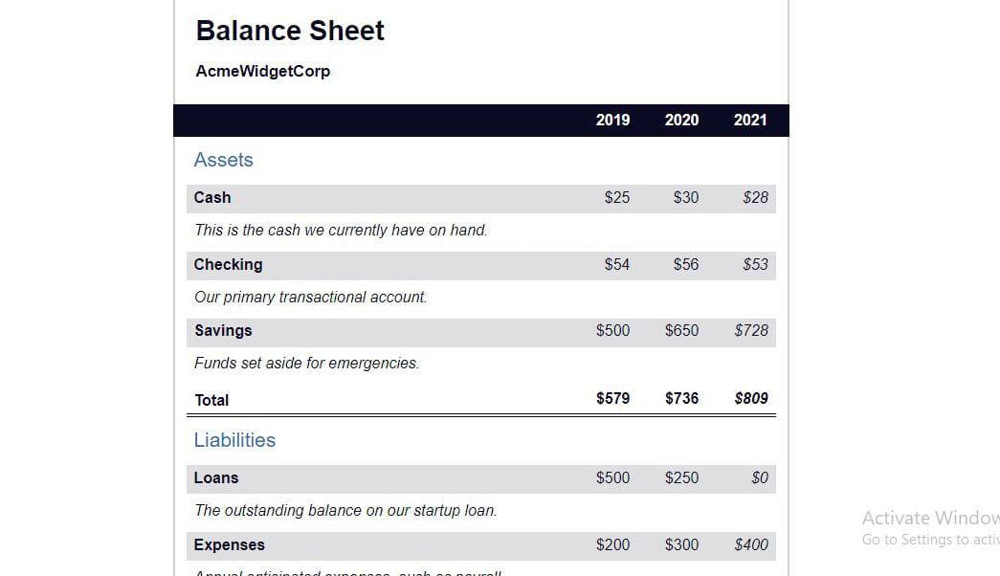

# Balance Sheet

> A balance sheet built using pseudo selectors



### In this project, you'll build a balance sheet using pseudo selectors. You'll learn how to change the style of an element when you hover over it with your mouse, and trigger other events on your webpage

## Built With

- ### HTML5 elements
  - **Heading element**
    `h1`
  - **Block element**
    `div` `section` `table` `caption`
  - **Inline element**
    `span`
  - **table element**
    `thead` `tr` `td` `th`
- ### CSS properties
  - CSS positioning `absolute`,
  - CSS background for page aesthetic using `background-color`, `background-image`.
  - CSS selectors `class selector` `id selector` `pseudo selector` `valid selector`
  - CSS linear gradient
- ### Linters
  - [prettier](prettier),
  - [stylelint](stylelint).

### GitHub Action

## Live Demo

[Live Demo Link](https://11-fcc-balancesheet.netlify.app)

### Development (Running locally)

- Clone the project

```bash
git clone https://github.com/Yinkusadel/11-fcc-balancesheet/pull/1

```

- Install Dependencies

```bash
yarn install
```

To run StyleLint by itself, you may run the lint task:

```bash
yarn lint:check
```

Or to automatically fix issues found (where possible):

```bash
yarn lint
```

You can also check against Prettier:

```bash
yarn format:check
```

and to have it fix (to the best of its ability) any format issues, run:

```bash
yarn format
```

You can also check against Webhint:

```bash
yarn hint
```

## Style Guides

- [CSS Style Guide](http://udacity.github.io/frontend-nanodegree-styleguide/css.html)
- [HTML Style Guide](http://udacity.github.io/frontend-nanodegree-styleguide/index.html)
- [JavaScript Style Guide](http://udacity.github.io/frontend-nanodegree-styleguide/javascript.html)
- [Git Style Guide](https://udacity.github.io/git-styleguide/)

## 👤 Author

- Github: [@yinkusadel](https://github.com/yinkusadel)
- Twitter: [@HashiraAdel](https://twitter.com/HashiraAdel)
- Linkedin: [@adeleyeolayinka](https://www.linkedin.com/in/adeleye-olayinka/)
- FreeCodeCamp: [@yinkusadel](https://www.freecodecamp.org/Yinkusadel)

## 🤝 Contributing

Contributions, issues and feature requests are welcome!

Feel free to check the [issues page](../../issues).

## Show your support

Give a ⭐️ if you like this project!

## Acknowledgments

- FreeCodeCamp: [@fcc-css-flexbox-photo-gallery](https://www.freecodecamp.org/learn/2022/responsive-web-design/learn-more-about-css-pseudo-selectors-by-building-a-balance-sheet/step-1)

## 📝 License

[MIT licensed](./LICENSE).
